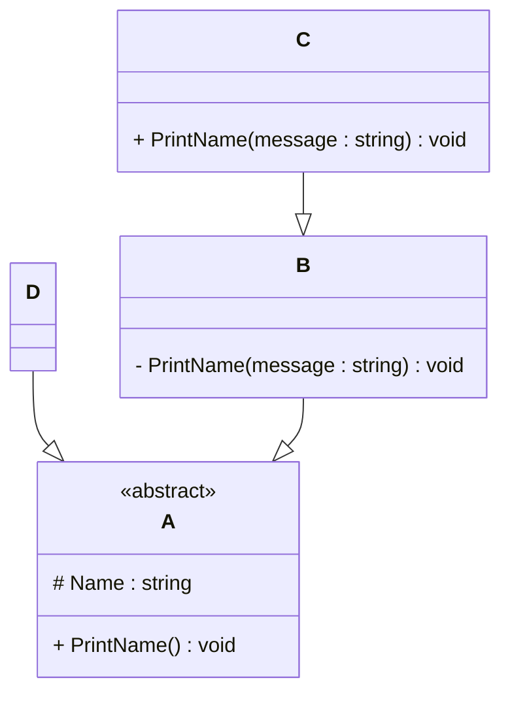

# Programming Test

This test was composed to create a general overview of your knowledge regarding general programming and how it fits with the needs in our lab. Please try to answer all questions using your own knowledge and in your own words. If you get stuck on one of the exercises, still try to give a short answer.

---

## Exercise 1

### Task

Write a program in the language of your choice where:

1. The iteration number (starting from 1), followed by a random number between 1 and 100, is printed 100 times.
2. After every 5 iterations, write an additional separator (e.g., `---`).
3. Write “Lucky number!” after every random number that is divisible by 7.

> Try to keep the procedure as short as possible.

---

## Exercise 2

### 1. **What is your understanding of the term “Design Patterns”?**

Design pattern are like template to solve coding problems. design pattern help you to avoid hard to maintain and messy code like repository pattern.

### 2. **Explain the MVC Pattern**

- What does MVC stand for? Model View Controller
- Explain the pattern in detail. Model: manages data and business rules. View: Display Data to user, Controlller: handles inpt of user and updates view
- What are some use cases for this framework? Web apps , Mobile apps, Desktop Apps,

### 3. **List three other design patterns**

- Provide names and details for three additional design patterns.
  ans: Singleton, Observer,strategy, respoistory pattern
- Explain how you have used those patterns in the past and how they have solved your problem
  ans :i have used only respoitory pattern and have good understanding of stratgey pattern. Repository pattern with n-Tier architecture it help me to manage data access, models in centerlised locations, and more maintable by dividing into multiple layers.

- Use diagrams to explain the design patterns.
  classDiagram
  direction TB

      class PresentationLayer {
          +UserController
      }

      class BusinessLayer {
          +UserService
      }

      class DataAccessLayer {
          +IUserRepository
          +UserRepository
      }

      class IUserRepository {
          <<interface>>
          +GetUser(id: int) User
          +AddUser(user: User) void
      }

      class UserRepository {
          +GetUser(id: int) User
          +AddUser(user: User) void
      }

      class Database {
          +Tables (Users, Orders, etc.)
      }

---

## Exercise 3

### 1. **Implementation Task**

Based on the class diagram below, provide an implementation in any object-oriented programming language of your choice.

### 2. **Key Questions**

- Are you able to directly create a new instance of `ObjectA`? Please explain your answer.
  Ans: no we cannot create new instance of because abstract class cannot be instantiate directly. A class is abstract designed for inhreited with other class.

- Given an instance of `ObjectC`, are you able to call the method `PrintMessage` defined in `ObjectB`? Please explain your answer.
  Ans: no, because class B PrintMessage is private only accessible within the same class.

- Try to explain as many key features of object-oriented programming as you can find in this example.
  Ans: 1. Inheritance: D--> A, B--> A, C-->B 2. Abstraction: Class A is abtract hides implementaion details just exposing funcionality. 3. Encapsulation , public, private, protected control access to class members. 4. polymorphism(override, new): same method behaves differently in different class and B and D override the Print Method and C hides the pritmethod of B and create new method with new keyword instead of overriding.  
   5. Contructors in Inheritance :base(name): Class C constructor pass name to B class contructor.

---

## Exercise 4

### Maintaining and Expanding Software for Component Validation

This exercise focuses on strategies for working with existing code bases and ensuring the software remains maintainable as new features and requirements are introduced.

### 1. **Working with Existing Code**

- How would you approach understanding and contributing to an existing code base with minimal disruption?
  Ans: by following the documentation, project structure or design pattern but first running the program.

- What practices would you follow to ensure your changes integrate well with the current structure?
  ans: well there is practice from company to company vary to manage the changes and i would use git to create PR and then after writing unit test and other validations later merge the branch.

### 2. **Ensuring Maintainability**

- What techniques would you use to keep the code base clean, modular, and easy to maintain as new features are added?
  ans: to acheive this alwasy refactor code into small chuncks and create organised folder hierarchy like folder by feature and follow SOLID principle.

- How would you handle code documentation and testing to support long-term maintainability?
  ans: by creating Readmes or architecture docs like diagram, data flows and doing unit test.

### 3. **Balancing Flexibility and Stability**

- How would you design or refactor the software to make it flexible for future changes while ensuring the existing functionality remains stable?
- Which design patterns or principles would you apply to achieve this balance

---
